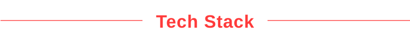
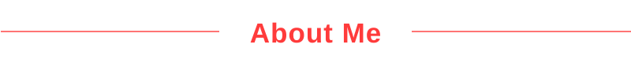
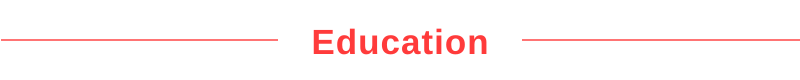
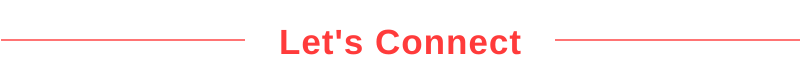

# Fernando Albuquerque

**`Nuclear Technologist - Fusion Scientist`**

  

  
  

  

  
  
  

  

  

Nuclear technologist and PhD candidate in Nuclear Technology at IPEN-CNEN/USP, working with fusion energy, advanced materials and plasma diagnostics. Currently doing also a Systems Analysis and Development course to strenghten my Data Analysis knowledge and experience focused on the Fusion Science environment.

  

<ul>
  <li>
    <em><strong>Nuclear and Energy Research Institute, University of São Paulo (IPEN-CNEN/USP)</strong></em>
    <ul>
      <li>● PhD in Nuclear Technology (ongoing)</li>
      <li>● MSc in Nuclear Technology – 2025</li>
    </ul>
  </li>

  <li>
    <em><strong>Federal Institute of São Paulo (IFSP)</strong></em>
    <ul>
      <li>● B.Tech. in Systems Analysis and Development (ADS) (ongoing)</li>
    </ul>
  </li>

  <li>
    <em><strong>Faculty of Technology of São Paulo (FATEC-SP)</strong></em>
    <ul>
      <li>● Technologist in Materials (Metallic Materials) – 2021</li>
    </ul>
  </li>

  <li>
    <em><strong>SENAI São Paulo</strong></em>
    <ul>
      <li>● Technical Degree in Mechatronics – 2018</li>
      <li>● Electro-Electronic Maintenance Technician – 2016</li>
    </ul>
  </li>
</ul>

<!GITHUB ACTIVITIES AND STATS>

<!--div align="center">
  

-->

<!--

  

  

-->

  

  
  

  

  

